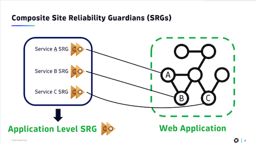

# Dynatrace Composite Site Reliability Guardians (SRGs) | GitHub Actions Example

## Background

Welcome 👋. This repository builds upon a Dynatrace Observability Lab example around Composite SRGs.

You might be asking yourself, what are Composite SRGs?  What's an SRG?  Who's Dynatrace?

For these questions, I'd like to refer you to the following links to dive deeper and learn more about Dynatrace
and the problems we help developers solve in the Observability space.

- [What Is Dynatrace?](https://docs.dynatrace.com/docs/get-started/what-is-dynatrace)
- [Dynatrace Site Reliability Guardian](https://www.dynatrace.com/hub/detail/site-reliability-guardian/)

> In short, Dynatrace is a revolutionary platform that delivers analytics and automation for unified observability and security.

### _What's a Composite SRG?_

Now that we've covered the basics, a Composite SRG is a logical grouping of individual SRGs which monitor an application
or services.  The concept behind creating a Composite SRG is so that teams have a single indicator representing the health
of their application driven by key service indicators (SLIs) that they've established.

With this single indicator unlocks a world of automation and possibilities

### _How do I create a Composite SRG?_

The creation of a Composite SRG depends on writing DQL queries which inspect the business events emitted by other SRGs
your team identifies as being related

### _What is the goal of this repository?_

One of the developer productivity enhancements that a Composite SRG offers is automation of pipeline quality gates.  Now
that we have a single indicator of application health, we can integrate this status into our pipeline stages.

This repository contains Python code which
1. Launches a Workflow executing all related SRGs
1. Checks when the SRGs have completed
1. Inspects the Composite SRGs final status

This Python code is then integrated with GitHub Actions to run the Python Code on any commit.  This ultimately completes
the Composite SRG demonstration by showing how the Composite SRG can be integrated with a developer's pipeline.

## Configuration

### Environment Variables

This Python Project uses Pydantic's `BaseSettings` class in-order to tune the code for the relevant environments.
All configurable parameters can be seen in `./composite_srg_pipeline/config.py`

- `DT_TOKEN_URL`: The OAUTH2 URL used to request a bearer token. Default Dynatrace URL is `https://sso.dynatrace.com/sso/oauth2/token`.
- `DT_CLIENT_ID`: OAUTH2 Client ID.  See [Dynatrace Documentation for further details](https://docs.dynatrace.com/docs/manage/identity-access-management/access-tokens-and-oauth-clients/oauth-clients#create-an-oauth2-client).
- `DT_CLIENT_SECRET`: OAUTH2 Client Secret.  See [Dynatrace Documentation for further details](https://docs.dynatrace.com/docs/manage/identity-access-management/access-tokens-and-oauth-clients/oauth-clients#create-an-oauth2-client). 
- `DT_SRG_WORKFLOW_UUID`: Dynatrace has a workflow used to orchestrate execution of all prerequisite SRGs. This should be set to the UUID of that workflow.
- `DT_TASK_NAME`: In the above Composite SRG Workflow, there is a single step which is responsible for executing the Composite SRG. This field should correpsond to that name.
- `DT_TENANT_ID`: The 8 character Tenant ID taken from `https://<TENANT_ID>.apps.dynatrace.com/ui`
- `WORKFLOW_RETRY_COUNT` _[Optional]_: (3) | The number of attempts we will make to request the status of the Composite SRG Workflow before considering the execution a failure.
- `WORKFLOW_RETRY_DELAY` _[Optional]_: (50) | The time delay (in seconds) between retried API queries for Workflow status.
- `WORKFLOW_RETRY_MAX_DELAY` _[Optional]_: (150) | The longest period of time we will await for a non 'RUNNING' Workflow Status result

### GitHub Secrets & Variables

The GitHub Actions pipeline sets the above Environment Variables for hte GitHub runner by pulling from GitHub Secrets & Variables.
For the mandatory environment variables above, please ensure to save `DT_CLIENT_SECRET` as a secret and set the remaining variables as
GitHub Variables.